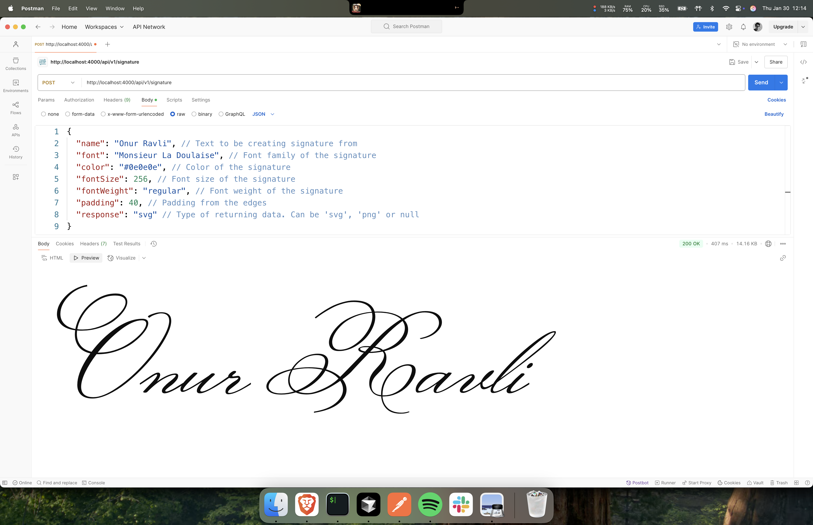

# Signature API

This is a simple API for generating signatures with Google Fonts API and OpenType.js.

[Live Demo](https://signature-api.onurravli.com)

### Prerequisites

- Node.js
- pnpm (or npm, ofc)
- Google Fonts API Key

### Installation

1. Clone the repository

```bash
git clone https://github.com/onurravli/signature-api.git
```

2. Install dependencies:

```bash
pnpm install
```

3. Copy `.env.example` to `.env` and set your Google Fonts API key:

```bash
GOOGLE_FONTS_API_KEY=your_api_key_here
```

### API Endpoints

#### Generate Signature

Generate a signature in SVG or PNG format.

**Endpoint:** `POST /api/v1/signature`

**Request Body Parameters:**

| Parameter  | Type             | Required | Default | Description                                     |
| ---------- | ---------------- | -------- | ------- | ----------------------------------------------- |
| name       | string           | Yes      | -       | The text to convert into signature              |
| font       | string           | Yes      | -       | Google Font family name                         |
| color      | string           | Yes      | -       | Color in any valid CSS format (hex, rgb, etc.)  |
| fontSize   | number           | No       | 72      | Font size in pixels                             |
| fontWeight | number or string | Yes      | -       | Font weight (e.g., 400, 700, "regular", "bold") |
| padding    | number           | No       | 20      | Padding around the signature in pixels          |
| apiKey     | string           | No       | -       | Google Fonts API key (optional if set in .env)  |
| response   | string           | No       | -       | Response format: "svg", "png", or both if empty |

**Example Request:**

```json
{
  "name": "John Doe",
  "font": "Dancing Script",
  "color": "#000000",
  "fontSize": 72,
  "fontWeight": 400,
  "padding": 20,
  "response": "svg"
}
```

**Example Response:**

For SVG response:

```json
{
  "svg": "<svg>...</svg>"
}
```

For PNG response:

```json
{
  "png": "data:image/png;base64,..."
}
```

For default response (both formats):

```json
{
  "svg": "<svg>...</svg>",
  "png": "data:image/png;base64,...",
  "width": 300,
  "height": 150,
  "name": "John Doe",
  "font": "Dancing Script",
  "color": "#000000",
  "fontSize": 72,
  "fontWeight": 400,
  "padding": 20
}
```



### Error Handling

The API returns appropriate HTTP status codes and error messages:

- `200 OK`: Request successful
- `500 Internal Server Error`: Server-side error with error message in response

Error Response Format:

```json
{
  "error": "Error message description"
}
```

### Development

1. Start the development server:

```bash
pnpm dev
```

2. Build for production:

```bash
pnpm build
```

3. Start production server:

```bash
pnpm start
```

### License

MIT License. See [LICENSE.md](LICENSE.md) for more details.
